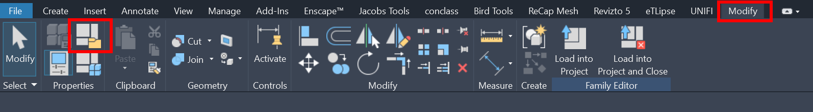
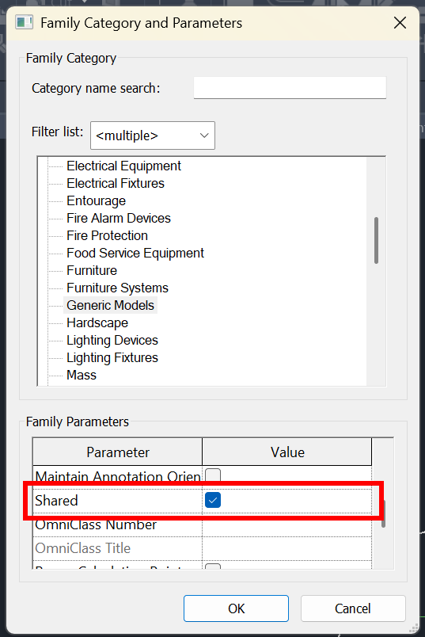
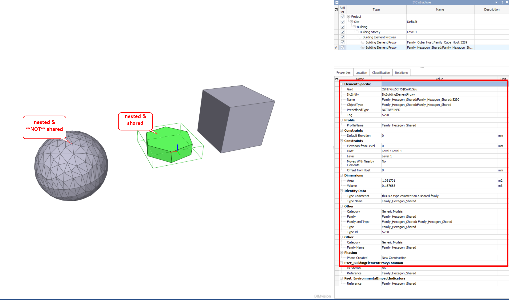
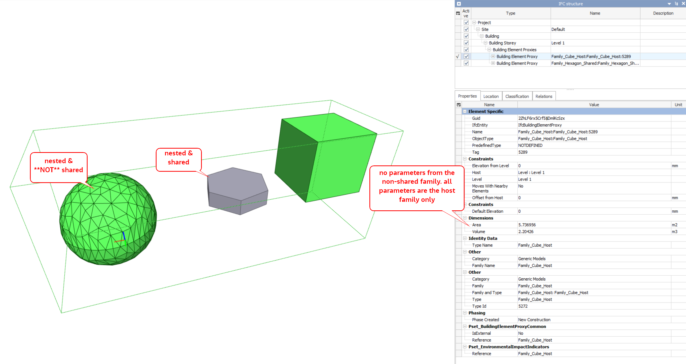

# Revit Nested Families and IFC Export Demo

This repository demonstrates how **shared** and **non-shared nested Revit families** behave when exported to IFC.

## Background

A common issue when exporting Revit models to IFC is that parameters from nested families do not appear in the exported IFC.

This can be particularly problematic for:

* Asset Information Requirements (AIR)
* Level of Information (LOI) attributes
* Classification data
* Element identification codes
* Client-specific metadata

When a family is nested inside another family, the export behaviour depends on whether the nested family is configured as **Shared**.

## What do you mean it needs to be shared?!

✅ **Shared nested families export as individual IFC elements and retain their own properties.**

❌ **Non-shared nested families do not export as separate IFC elements. Their geometry is merged into the host family and their parameters are not available in the IFC.**

***

## Test Model

The example model contains:

| Family  | Configuration         |
| ------- | --------------------- |
| Cube    | Host family           |
| Hexagon | Nested and Shared     |
| Sphere  | Nested and NOT Shared |

The host family contains both nested components.

***

## How to Configure a Shared Nested Family

Open the nested family and enable the **Shared** setting:

`Family Category and Parameters → Shared`

Reload the family into the host family and then into the project.

***

## IFC Export Results

### Shared Nested Family

The shared hexagon family is exported as a separate IFC object.

Benefits:

* Appears as its own IFC element
* Receives its own IFC GUID
* Retains its own parameters
* Supports individual classification and asset data

Example:

The IFC viewer shows:

* Separate IFC object
* Family name retained
* Type information retained
* Family parameters available

***

### Non-Shared Nested Family

The non-shared sphere family does not export as a separate IFC object.

Example:

Observed behaviour:

* Geometry becomes part of the host element
* No separate IFC object is created
* Nested family parameters are not available
* Only host family properties remain visible

***

## Comparison

| Behaviour                | Shared Nested Family | Non-Shared Nested Family |
| ------------------------ | -------------------- | ------------------------ |
| Separate IFC Object      | ✅                    | ❌                        |
| Own IFC GUID             | ✅                    | ❌                        |
| Own Parameters Available | ✅                    | ❌                        |
| Own Classification Data  | ✅                    | ❌                        |
| Geometry Exported        | ✅                    | ✅                        |
| Exported Independently   | ✅                    | ❌                        |

***

## Why This Matters

Many projects embed asset components as nested families.

If these nested components are not configured as **Shared**:

* Asset information may be missing from IFC deliverables.
* Classification information may not be exported.
* LOI requirements may not be met.
* Multiple assets may become indistinguishable within the IFC model.

A common workaround is to copy parameters onto the host family. While this can expose the data in IFC, it often introduces maintenance challenges and can create duplicated attribute values across multiple nested instances.

Using **Shared nested families** is generally the preferred approach when the nested component needs to exist as an identifiable asset in the IFC model.

***

## Repository Contents

| File                            | Description                            |
| ------------------------------- | -------------------------------------- |
| `Nested_Family_To_Ifc_Demo.rvt` | Source Revit model                     |
| `Nested_Family_To_Ifc_Demo.ifc` | Exported IFC                           |
| `images/`                       | Screenshots used in this documentation |

***

## So what you gonna do?

If a nested family needs to appear as a separate object in IFC and carry its own metadata, it must be configured as **Shared**.

This simple test model demonstrates the difference between shared and non-shared nested families and can be used as a reference when troubleshooting missing IFC properties or asset information.

***

*Tested using Autodesk Revit 2025 and standard IFC 4.3 export configuration.*
